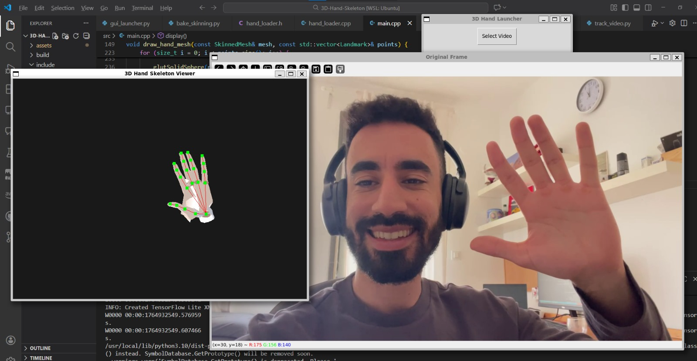
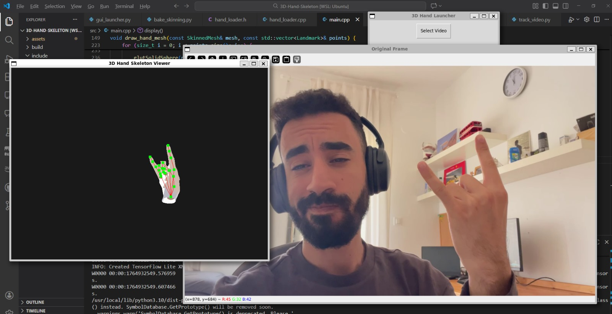
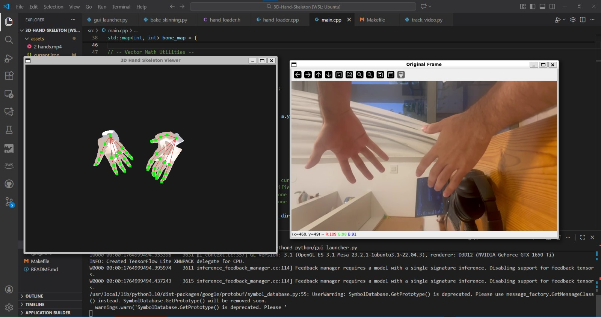

# 3D Hand Tracking & MANO Visualization

**Mini-Project: Image Processing Course**

A high-performance, cross-language project that combines **MediaPipe AI (Python)** for tracking and **OpenGL (C++)** for real-time anatomical rendering. This system detects hand landmarks from video and maps them onto a realistic **MANO mesh** with dynamic skinning and bone stretching.

This project supports:
- **Dual Hands:** Simultaneous detection and rendering of Left and Right hands.
- **MANO Mesh:** Anatomically correct mesh visualization (via SMPL/MANO models).
- **Hybrid Architecture:** Python for processing ↔ C++ for 3D graphics.

---

## Preview
 
 
 

 UI:

 

---

## Key Features

- **Real-Time Tracking:** Uses MediaPipe to extract 21 skeletal keypoints per hand.  
- **Anatomical Rendering:** Renders the MANO mesh (vertices & faces) instead of stick figures.  
- **Dynamic Bone Stretching:** The C++ engine calculates bone vectors in real-time and stretches the mesh skin to match the user's actual finger lengths and movements.  
- **Articulated Joints:** Uses spherical geometry to fill gaps at finger joints during sharp bends.  
- **Hybrid IPC System:** Synchronizes data between Python and C++ using atomic file exchanges (`current.json`) to prevent race conditions.  
- **GUI Launcher:** A simple Tkinter interface to load videos and start the system.

---

## Folder Structure

```text
3D-Hand-Skeleton/
├── assets/                  # Resources
│   ├── MANO_RIGHT.pkl       # (Required) Official MANO model
│   ├── MANO_LEFT.pkl        # (Required) Official MANO model
│   ├── mano_right.json      # Baked mesh data for C++
│   ├── mano_left.json       # Baked mesh data for C++
│   └── hand_video.mp4       # Current input video
│
├── build/                   # Compiled Binaries
│   └── hand_skeleton        # The C++ Viewer executable
│
├── include/                 # C++ Headers
│   └── hand_loader.h
│
├── src/                     # C++ Source Code
│   ├── main.cpp             # OpenGL render loop & logic
│   └── hand_loader.cpp      # JSON parsing & mesh loading
│
├── python/                  # Python Logic
│   ├── track_video.py       # MediaPipe tracking script
│   ├── bake_skinning.py     # Converts .pkl models to .json
│   └── gui_launcher.py      # Desktop GUI
│
├── Makefile                 # Build script
├── README.md
└── requirements.txt
```

---

## Prerequisites & Installation

### 1. System Packages (Ubuntu / WSL)

Install C++ compilers, OpenGL libraries, and JSON support:

```bash
sudo apt update
sudo apt install build-essential libgl1-mesa-dev libglu1-mesa-dev freeglut3-dev                  nlohmann-json3-dev python3-pip python3-tk ffmpeg
```

### 2. Python Dependencies

```bash
pip3 install -r requirements.txt
```

(Or manually: `pip3 install mediapipe opencv-python numpy`)

### 3. Setup MANO Models

To use the mesh visualization, you must have the MANO model files.

1. Place `MANO_RIGHT.pkl` and `MANO_LEFT.pkl` into the `assets/` folder.  
2. Run the "baking" script to convert them for the C++ engine:

```bash
python3 python/bake_skinning.py
```

Output: This will generate `mano_right.json` and `mano_left.json`.

### 4. Compile C++ Viewer

```bash
make
```

---

## How to Run

### Method A: GUI Launcher (Recommended)

The easiest way to start.

Run the Python launcher:

```bash
python3 python/gui_launcher.py
```

- Click **"Select Video"** to choose any `.mp4` file.  
- Click **"Start Tracker + Viewer"**.

### Method B: Terminal Mode (Manual)

1. Place your video in `assets/hand_video.mp4`.

2. Open **Terminal 1 (The Brain)**:

```bash
python3 python/track_video.py
```

3. Open **Terminal 2 (The Display)**:

```bash
./build/hand_skeleton
```

---

## How It Works Internally

1. **Detection (Python):**  
   - Python captures a frame, converts BGR → RGB, and feeds it to MediaPipe.  

2. **Extraction:**  
   - Hand landmarks `(x, y, z)` and handedness (Left/Right) are extracted.  

3. **Serialization:**  
   - Data is dumped to `current.json.tmp` and atomically renamed to `current.json`  
     so the C++ reader never reads a half-written file.  

4. **Rendering (C++):**  
   - Parses the JSON.  
   - Identifies the hand side.  
   - Calculates Rodrigues' Rotation Formula to align the mesh bones with the tracked skeleton.  
   - Applies linear stretching to fit the mesh to the user's hand proportions.  
   - Renders with OpenGL lighting and smoothing.  

---

## Technologies Used

- **MediaPipe** – AI Hand Tracking  
- **OpenGL / GLUT** – 3D Graphics Rendering  
- **MANO Model** – Hand Mesh Topology  
- **nlohmann/json** – C++ JSON Parser  
- **OpenCV** – Video I/O  

