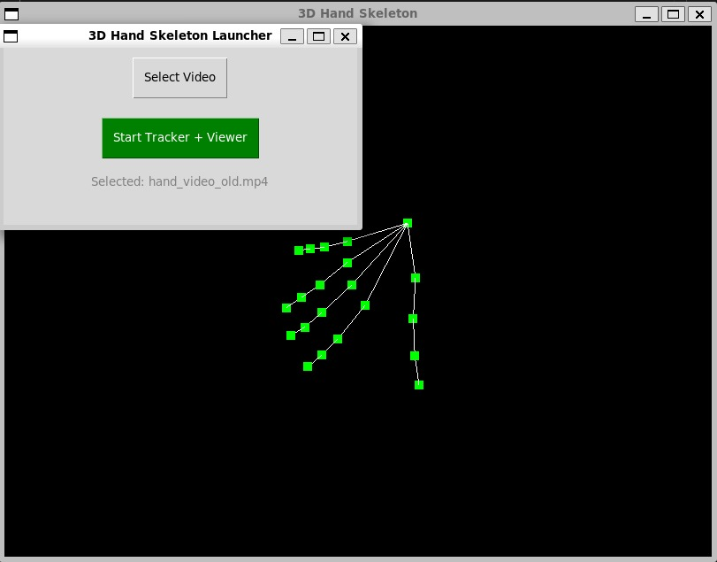

# 3D Hand Skeleton Viewer

Mini project course in image processing. A cross-language project that combines **MediaPipe (Python)** and **OpenGL (C++)** to detect hand landmarks from a video and visualize a **live 3D skeleton** in real time.

This project supports:
- Static hand image → 3D hand model
- MP4 video → real-time animated hand skeleton
- Simple desktop GUI launcher to run both tracker and visualizer

---

##  Preview IMG



---

## Features Implemented

- Hand tracking using MediaPipe (21 keypoints)
- 3D rendering in OpenGL with depth
- Animation synced with video frames
- Safe file syncing with atomic JSON overwrite
- GUI interface for selecting video and launching the app

---

## Notes

- The viewer uses `current.json`, which is updated live by Python every 1/30s.
- Only one `.json` file is used at runtime to avoid disk clutter.
- The GUI auto-copies your selected video into `assets/hand_video.mp4`.

---

## Folder Structure

```
3D-Hand-Skeleton/
├── assets/              # Images, videos, JSON outputs
│   ├── hand_video.mp4
│   ├── current.json
│   └── hand.jpg
│
├── build/               # Compiled C++ binaries
│   └── hand_skeleton
│
├── include/             # C++ header files
│   └── hand_loader.h
│
├── src/                 # C++ source files
│   ├── main.cpp
│   └── hand_loader.cpp
│
├── python/              # Python scripts (MediaPipe + GUI)
│   ├── track_video.py
│   ├── extract_hand.py
│   └── gui_launcher.py
│
├── Makefile             # C++ build configuration
├── README.md
└── requirements.txt     # Python dependencies
```

---

## Requirements

### System Packages (Ubuntu/WSL)
Install C++ + OpenGL + MediaPipe prerequisites:
```bash
sudo apt update
sudo apt install build-essential libgl1-mesa-dev libglu1-mesa-dev freeglut3-dev \
                 nlohmann-json3-dev python3-pip python3-tk ffmpeg
```

### Python Packages
Install MediaPipe, OpenCV, and GUI support:

```bash
pip3 install mediapipe opencv-python
```

---

## How to Run

### Terminal Mode (No GUI)
1. Put your `.mp4` video in `assets/hand_video.mp4`
2. In one terminal:
    ```bash
    python3 python/track_video.py
    ```
3. In another terminal:
    ```bash
    make
    ./build/hand_skeleton
    ```

---

### GUI Launcher Mode
1. Run the launcher:
    ```bash
    python3 python/gui_launcher.py
    ```
2. Select a video file (any .mp4)
3. Click “Start Tracker + Viewer”

---

## Built using

- [MediaPipe by Google](https://github.com/google/mediapipe)
- [OpenGL](https://www.opengl.org/)
- [nlohmann/json](https://github.com/nlohmann/json)
- [OpenCV](https://opencv.org/)
